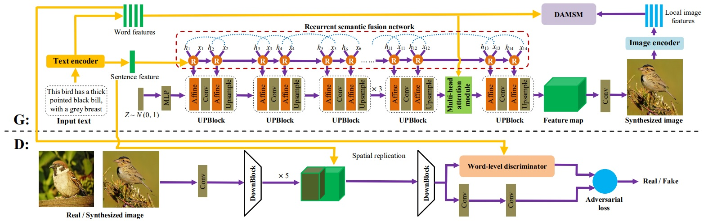

# DMF-GAN
[](https://github.com/tobran/DF-GAN/blob/master/LICENSE.md)


# DMF-GAN: Deep Multimodal Fusion Generative Adversarial Networks for Text-to-Image Synthesis

Official Pytorch implementation for our paper [DMF-GAN: Deep Multimodal Fusion Generative Adversarial Networks for Text-to-Image Synthesis]



---

## Requirements
- python 3.8
- Pytorch 1.9
- At least 1x24GB NVIDIA GPU
## Installation

Clone this repo.
```
git clone https://github.com/tobran/DMF-GAN
pip install -r requirements.txt
cd DMF-GAN/code/
```

## Preparation
### Datasets
1. Download the preprocessed metadata for [birds](https://drive.google.com/file/d/1I6ybkR7L64K8hZOraEZDuHh0cCJw5OUj/view?usp=sharing) [coco](https://drive.google.com/file/d/15Fw-gErCEArOFykW3YTnLKpRcPgI_3AB/view?usp=sharing) and extract them to `data/`
2. Download the [birds](http://www.vision.caltech.edu/visipedia/CUB-200-2011.html) image data. Extract them to `data/birds/`
3. Download [coco2014](http://cocodataset.org/#download) dataset and extract the images to `data/coco/images/`


## Training
  ```
  cd DF-GAN/code/
  ```
### Train the DF-GAN model
  - For bird dataset: `bash scripts/train.sh ./cfg/bird.yml`
  - For coco dataset: `bash scripts/train.sh ./cfg/coco.yml`

The code is released for academic research use only. For commercial use, please contact [Xueqin Xiang](xxueq@aliyun.com).

**Reference**

- [StackGAN++: Realistic Image Synthesis with Stacked Generative Adversarial Networks](https://arxiv.org/abs/1710.10916) [[code]](https://github.com/hanzhanggit/StackGAN-v2)
- [AttnGAN: Fine-Grained Text to Image Generation with Attentional Generative Adversarial Networks](https://openaccess.thecvf.com/content_cvpr_2018/papers/Xu_AttnGAN_Fine-Grained_Text_CVPR_2018_paper.pdf) [[code]](https://github.com/taoxugit/AttnGAN)
- [DM-GAN: Realistic Image Synthesis with Stacked Generative Adversarial Networks](https://arxiv.org/abs/1904.01310) [[code]](https://github.com/MinfengZhu/DM-GAN)
- [DF-GAN: A Simple and Effective Baseline for Text-to-Image Synthesis](https://openaccess.thecvf.com/content/CVPR2022/papers/Tao_DF-GAN_A_Simple_and_Effective_Baseline_for_Text-to-Image_Synthesis_CVPR_2022_paper.pdf) [[code]](https://github.com/tobran/DF-GAN)
- [Recurrent Affine Transformation for Text-to-image Synthesis](https://arxiv.org/abs/2204.10482) [[code]](https://github.com/senmaoy/RAT-GAN)
